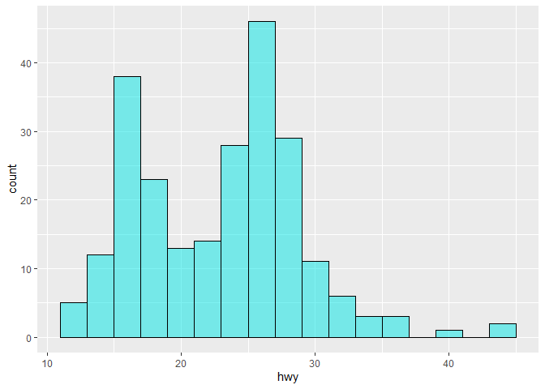
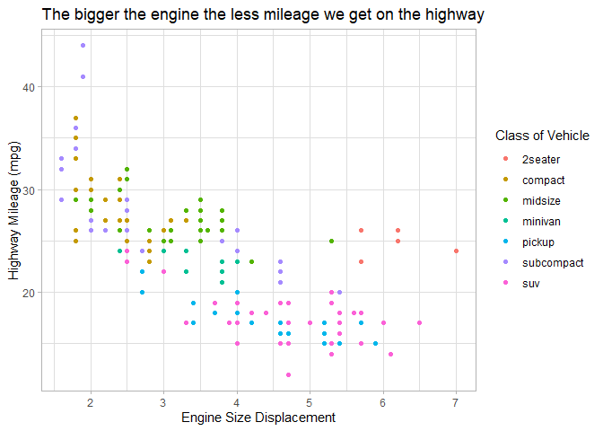

# Visualize Data
Alexis Zarate
2026-02-10

<!-- If you get the error "Error in list2(na.rm = na.rm, ...) : object 'ffi_list2' not found" do the following in the Console run:  
&#10;    remove.packages("rlang")
&#10;Then Restart R to be safe. Then run:
&#10;    install.packages("rlang")
&#10;and again restart R to be safe. That should fix the problem (which is a package dependency issue).   -->

Try your code again

## Your Turn 0

Add a setup chunk that loads the tidyverse packages.

``` r
### viewing the first 6 rows of data from the mpg dataset, using head()
### dataset is 234 x 11
dim(mpg) 
```

    [1] 234  11

``` r
head(mpg)
```

    # A tibble: 6 × 11
      manufacturer model displ  year   cyl trans      drv     cty   hwy fl    class 
      <chr>        <chr> <dbl> <int> <int> <chr>      <chr> <int> <int> <chr> <chr> 
    1 audi         a4      1.8  1999     4 auto(l5)   f        18    29 p     compa…
    2 audi         a4      1.8  1999     4 manual(m5) f        21    29 p     compa…
    3 audi         a4      2    2008     4 manual(m6) f        20    31 p     compa…
    4 audi         a4      2    2008     4 auto(av)   f        21    30 p     compa…
    5 audi         a4      2.8  1999     6 auto(l5)   f        16    26 p     compa…
    6 audi         a4      2.8  1999     6 manual(m5) f        18    26 p     compa…

## Your Turn 1

Run the code on the slide to make a graph. Pay strict attention to
spelling, capitalization, and parentheses!

``` r
### initializing a plot with ggplot(), adding layers with geom functions 
ggplot(mpg) +
  geom_point(aes(x = displ, 
                 y = hwy))
```


## Your Turn 2

Replace this scatterplot with one that draws boxplots. Use the
cheatsheet. Try your best guess.

``` r
### utilizing a boxplot to visualize the distribution of the mpg dataset
ggplot(mpg) +
  geom_boxplot(aes(x = class, 
                   y = hwy))
```


## Your Turn 3

Make a histogram of the `hwy` variable from `mpg`. Hint: do not supply a
y variable.

``` r
### histograms used for visualizing the frequency distribution of the mpg dataset
ggplot(mpg) +
  geom_histogram(aes(x = hwy))
```

    `stat_bin()` using `bins = 30`. Pick better value `binwidth`.


## Your Turn 4

Use the help page for `geom_histogram` to make the bins 2 units wide.

``` r
### histograms used for visualizing the frequency distribution of the mpg dataset
ggplot(mpg) +
  geom_histogram(aes(x = hwy), 
                 binwidth = 2)
```


## Your Turn 5

Add `color`, `size`, `alpha`, and `shape` aesthetics to your graph.
Experiment.

``` r
### using 
ggplot(mpg) +
  geom_histogram(aes(x = hwy),
                    binwidth = 2,
                    alpha = 0.5,
                    fill = "#00e6e6",
                    color = "black")
```



``` r
### scatterplot with aesthetics 
ggplot(mpg) +
  geom_point(aes(x = displ,
                 y = hwy,
                 color = class)) + 
  labs(x = "Engine Size Displacement",
       y = "Highway Mileage (mpg)",
       color = "Class of Vehicle",
       title = "The bigger the engine the less mileage we get on the highway") + 
  theme_light()
```



## Help Me

What do `facet_grid()` and `facet_wrap()` do? (run the code, interpret,
convince your group)

``` r
# Makes a plot that the commands below will modify
q <- ggplot(mpg) + geom_point(aes(x = displ, y = hwy))

q + facet_grid(. ~ cyl) ### make one row, four columns by cyl
```


``` r
q + facet_grid(drv ~ .) ### makes three rows, one column by drv
```


``` r
q + facet_grid(drv ~ cyl) ### makes three rows by drv, four columns by cyl
```


``` r
q + facet_wrap(~ class) ### makes a graph for each value in class
```


## Your Turn 6

Make a bar chart `class` colored by `class`. Use the help page for
`geom_bar` to choose a “color” aesthetic for class.

``` r
### barplot with aesthetics 
ggplot(mpg) +
  geom_bar(aes(x = class,
               fill = drv),
  position = position_dodge())+
  guides(fill = "none") +
  labs(x = "Class of Vehicle",
       y = "Number of Vehicles in Sample") + 
  theme_bw()
```


## Quiz

What will this code do?

``` r
ggplot(mpg, aes(x = displ, y = hwy)) + 
  geom_point(aes(color = class)) +
  geom_smooth(color = "black",
                  se = FALSE,
                  method = "lm")
```

    `geom_smooth()` using formula = 'y ~ x'


``` r
#ggsave("example.jpg", width = 6, height = 4)
```

------------------------------------------------------------------------

# Take aways

You can use this starter code template to make thousands of graphs with
**ggplot2**.

``` r
#ggplot(data = <DATA>) +
  #<GEOM_FUNCTION>(mapping = aes(<MAPPINGS>))
```
